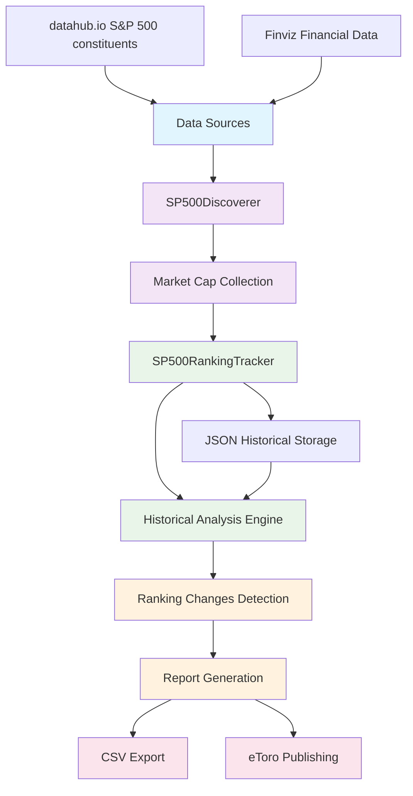
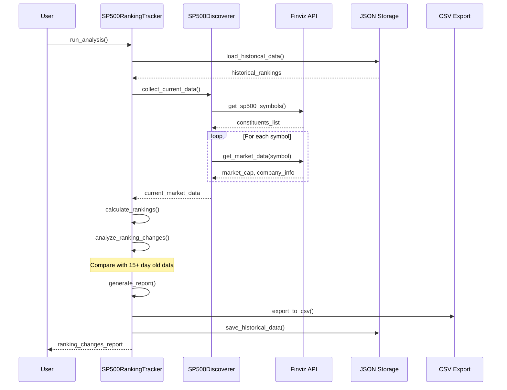

# SimplifiCare Finance - S&P 500 Market Cap Tracker

[](https://www.python.org/downloads/)
[](LICENSE)
[](https://pypi.org/project/simplificare-finance/)

A sophisticated Python toolkit for tracking S&P 500 market capitalization rankings and analyzing market movements over time. This system powers automated financial analysis reports published every 15 days on [eToro](https://www.etoro.com/people/bantwal).

## 🎯 Core Functionality

SimplifiCare Finance provides comprehensive S&P 500 market analysis through:

- **Real-time Market Cap Tracking**: Fetches current market capitalizations for all S&P 500 constituents
- **Ranking Analysis**: Tracks position changes in market cap rankings over 15-day periods
- **Historical Data Management**: Maintains persistent JSON-based historical tracking
- **Automated Reporting**: Generates detailed analysis reports with top movers
- **CSV Export**: Exports ranking changes for further analysis
- **eToro Integration**: Powers bi-weekly market analysis posts

## 🏗️ System Architecture

### High-Level Component Diagram



### Data Flow Architecture



## 🔧 Installation & Setup

### Prerequisites

- Python 3.12+
- Internet connection for real-time data fetching

### Installation Options

#### From PyPI (Recommended)
```bash
pip install simplificare-finance
```

#### From TestPyPI
```bash
pip install --index-url https://test.pypi.org/simple/ --extra-index-url https://pypi.org/simple simplificare-finance==0.1.3
```

#### Development Installation
```bash
git clone https://github.com/paihari/simplificare-finance.git
cd simplificare-finance
pip install -e ".[dev]"
```

## 🚀 Usage Examples

### Basic Usage

```python
from discovery.tracker import SP500RankingTracker

# Initialize tracker for top 50 companies
tracker = SP500RankingTracker(top_n=50)

# Run complete analysis with CSV export
results = tracker.run_analysis(export_csv=True)
```

### Advanced Configuration

```python
from discovery.tracker import SP500RankingTracker
from discovery.discoverer import SP500Discoverer

# Custom configuration
discoverer = SP500Discoverer(top_n=100)
tracker = SP500RankingTracker(
    data_file='custom_tracking_data.json',
    top_n=100
)

# Run analysis
ranking_changes = tracker.run_analysis(export_csv=True)

# Manual CSV export with custom filename
tracker.export_to_csv(ranking_changes, "sp500_analysis_custom.csv")
```

### Programmatic Access

```python
# Access historical data
historical_data = tracker.load_historical_data()

# Get specific company rankings
current_rankings = tracker.discoverer.calculate_rankings(current_data)
nvidia_rank = current_rankings['NVDA']['rank']
```

## 📊 Data Sources & Dependencies

### External Data Sources
- **S&P 500 Constituents**: [datahub.io](https://datahub.io/core/s-and-p-500-companies)
- **Market Data**: [Finviz](https://finviz.com/) via `finvizfinance` library

### Core Dependencies
- `finvizfinance>=1.1.1` - Financial data retrieval
- `pandas>=2.3.1` - Data manipulation and analysis

### Development Dependencies
- `pytest>=7.0` - Testing framework
- `black>=23.0` - Code formatting
- `isort>=5.0` - Import sorting
- `mypy>=1.0` - Type checking

## 📈 Output & Reports

### Console Report Example
```
🎯 Starting S&P 500 Ranking Analysis...
📅 Analysis Date: 2025-08-26 08:47:32

📊 Successfully ranked 50 companies
📊 Comparison with data from 2025-08-11 (15 days ago)

================================================================================
🚀 S&P 500 RANKING MOVERS - BIGGEST INCREASES (Last 15+ Days)
================================================================================

📈 TOP 7 BIGGEST RANKING INCREASES:
--------------------------------------------------------------------------------
 1. UNH    - Unitedhealth Group Inc        
     Rank: #37 → #30 (+7 positions)
     Market Cap:   276.10B (+21.3%)

 2. MRK    - Merck & Co Inc                
     Rank: #47 → #43 (+4 positions)
     Market Cap:   213.09B (+5.7%)
```

### CSV Export Structure
The system generates CSV files with the following columns:
- `symbol` - Stock ticker symbol
- `company` - Company name
- `current_rank` - Current market cap ranking
- `previous_rank` - Previous ranking (15+ days ago)
- `rank_change` - Position change (positive = moved up)
- `direction` - UP/DOWN indicator
- `current_market_cap` - Current market capitalization
- `market_cap_change_pct` - Percentage change in market cap

## 🔄 Automation & eToro Integration

### 15-Day Analysis Cycle
The system is designed around a 15-day analysis cycle:

1. **Data Collection**: Fetches current S&P 500 market data
2. **Historical Comparison**: Compares against data from 15+ days ago
3. **Ranking Analysis**: Identifies significant position changes
4. **Report Generation**: Creates detailed movement analysis
5. **Export**: Saves results in CSV format
6. **Publication**: Data used for eToro market analysis posts

### Historical Data Management


## 📁 Project Structure

```
simplificare-finance/
├── src/
│   └── discovery/
│       ├── __init__.py
│       ├── discoverer.py      # SP500Discoverer class - data collection
│       └── tracker.py         # SP500RankingTracker class - analysis engine
├── sp500_tracking_data.json   # Historical rankings database
├── sp500_ranking_changes_*.csv # Exported analysis results
├── pyproject.toml             # Project configuration
├── LICENSE                    # MIT License
└── README.md                  # This file
```

## 🎯 Key Features Deep Dive

### Market Cap Data Collection (`src/discovery/discoverer.py:48-102`)
- Fetches real-time market capitalization data for all S&P 500 constituents
- Handles rate limiting with 0.8-second delays between API calls
- Processes market cap strings (T/B/M suffixes) into comparable numeric values
- Maintains fallback list of major companies if API fails

### Ranking Analysis Engine (`src/discovery/tracker.py:64-118`)
- Compares current rankings against historical data from 15+ days ago
- Calculates position changes and percentage market cap changes
- Maintains persistent JSON storage for historical tracking
- Identifies top movers in both directions (up/down)

### Report Generation (`src/discovery/tracker.py:120-157`)
- Generates formatted console reports with top 10 movers
- Shows rank changes, market cap values, and percentage changes
- Separates upward and downward movements for clarity

## 🧪 Testing & Development

### Running Tests
```bash
pytest
```

### Code Quality
```bash
# Format code
black src/

# Sort imports
isort src/

# Type checking
mypy src/
```

## 🌐 Real-World Usage

This system powers automated market analysis published on:
- **eToro Profile**: [https://www.etoro.com/people/bantwal](https://www.etoro.com/people/bantwal)
- **Publishing Schedule**: Every 15 days
- **Analysis Focus**: Top market cap movers and ranking changes

The bi-weekly analysis helps investors identify significant market cap shifts and emerging trends in the S&P 500 landscape.

## 📋 API Reference

### SP500Discoverer Class

```python
class SP500Discoverer:
    def __init__(self, top_n=50)
    def get_sp500_symbols() -> List[str]
    def collect_market_cap_data() -> Dict
    def collect_current_data() -> Dict
    def calculate_rankings(data: Dict) -> Dict
```

### SP500RankingTracker Class

```python
class SP500RankingTracker:
    def __init__(self, data_file='sp500_tracking_data.json', top_n=50)
    def run_analysis(export_csv=True) -> List[Dict]
    def analyze_ranking_changes(current_rankings: Dict) -> List[Dict]
    def generate_report(ranking_changes: List[Dict]) -> None
    def export_to_csv(ranking_changes: List[Dict], filename=None) -> None
```

## 🤝 Contributing

Contributions are welcome! Please follow these steps:

1. Fork the repository
2. Create a feature branch (`git checkout -b feature/amazing-feature`)
3. Commit your changes (`git commit -m 'Add some amazing feature'`)
4. Push to the branch (`git push origin feature/amazing-feature`)
5. Open a Pull Request

### Development Setup
```bash
git clone https://github.com/paihari/simplificare-finance.git
cd simplificare-finance
python -m venv .venv
source .venv/bin/activate  # On Windows: .venv\Scripts\activate
pip install -e ".[dev]"
```

## 📄 License

This project is licensed under the MIT License - see the [LICENSE](LICENSE) file for details.

## 👤 Author

**Hari Bantwal**
- Email: hari@simplificare.ch
- eToro: [bantwal](https://www.etoro.com/people/bantwal)
- GitHub: [@paihari](https://github.com/paihari)

## 🔗 Links

- **PyPI Package**: https://pypi.org/project/simplificare-finance/
- **Source Code**: https://github.com/paihari/simplificare-finance
- **eToro Analysis**: https://www.etoro.com/people/bantwal
- **Documentation**: https://github.com/paihari/simplificare-finance#readme

